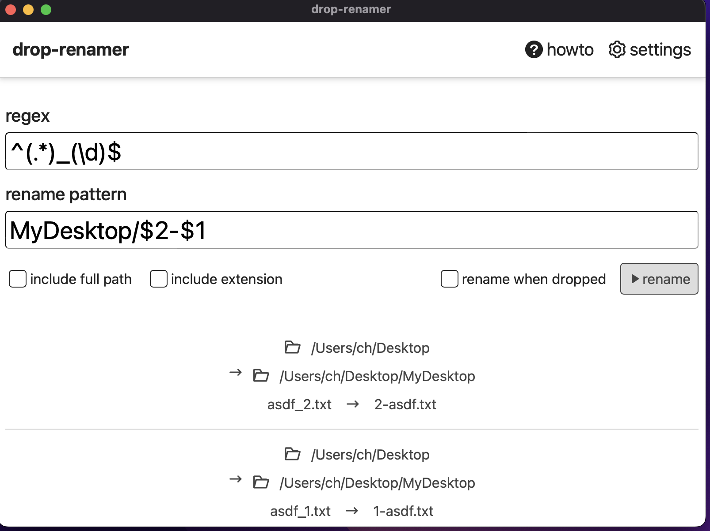

# drop-renamer (WIP)

Work in progress

Simple app for: drag-drop files to rename with some regex pattern.

remake of [dropReplacer](https://github.com/sftblw/dropReplacer)

started from tauri's `Tauri + Solid + Typescript` template.

## dev

requires: nodejs, rust (cargo) installed

1. npm i
2. npm run tauri dev

## TODO

- [x] rename when files are dropped
- [x] basic layout & styling
- [x] direct options (v0.0.1)
  - [x] include extensions
  - [x] include fullpath
  - [x] rename instantly when dropped
- [ ] rename items
  - [ ] edit before rename
- [ ] license thing: add MIT license, add dependencies notice
- [ ] deploy